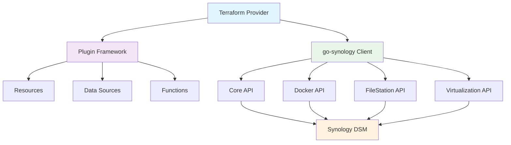

# Terraform Synology Provider - Developer Guide

[](https://github.com/synology-community/terraform-provider-synology/releases)
[](https://github.com/synology-community/terraform-provider-synology/blob/main/LICENSE)
[](https://goreportcard.com/report/github.com/synology-community/terraform-provider-synology)

A Terraform provider for managing [Synology NAS](https://www.synology.com/dsm/solution/what-is-nas/for-home) servers through the Synology DSM API. Built with [Terraform Plugin Framework](https://developer.hashicorp.com/terraform/plugin/framework) and the [go-synology](https://github.com/synology-community/go-synology) API client.

> **For usage documentation**, see the [Terraform Registry documentation](https://registry.terraform.io/providers/synology-community/synology/latest/docs) or browse [examples/](./examples).

## Features

- **Core Management**: Package installation, package feeds, task scheduler, events
- **Container Management**: Docker Compose projects with full service configuration
- **File Station**: File operations and cloud-init ISO generation
- **Virtualization**: Virtual machine lifecycle management
- **Generic API**: Direct access to any Synology DSM API endpoint

### Architecture



## Quick Start

### For Users

See the [Provider Documentation](https://registry.terraform.io/providers/synology-community/synology/latest/docs) for usage examples and configuration.

**Quick Example:**

```hcl
terraform {
  required_providers {
    synology = {
      source  = "synology-community/synology"
      version = "~> 1.0"
    }
  }
}

provider "synology" {
  host     = "your-synology.local:5001"
  user     = "admin"
  password = var.synology_password
}

resource "synology_container_project" "app" {
  name = "my-app"
  
  services = {
    web = {
      image = "nginx:latest"
      ports = [{ target = 80, published = "8080" }]
    }
  }
}
```

### For Developers

#### Prerequisites

- [Go 1.21+](https://golang.org/doc/install)
- [Terraform 1.5+](https://www.terraform.io/downloads)
- [Docker Desktop](https://www.docker.com/products/docker-desktop) (for acceptance tests)
- Make (optional, for convenience commands)

#### Building

```bash
# Clone the repository
git clone https://github.com/synology-community/terraform-provider-synology.git
cd terraform-provider-synology

# Build the provider
go build .

# Install locally for testing
make install
```

#### Running Tests

**Unit Tests:**

```bash
go test ./synology/...
```

**Acceptance Tests:**

The provider uses [testcontainers-go](https://testcontainers.com/) to run acceptance tests against a virtualized Synology DSM instance. This avoids the need to test against real infrastructure.

```bash
# Run all acceptance tests
TF_ACC=1 go test ./synology/provider/... -v -timeout 30m

# Run specific test
TF_ACC=1 go test ./synology/provider/... -v -run TestAccResource_ContainerProject

# Show DSM container output
TF_ACC=1 DSM_STDOUT=1 go test ./synology/provider/... -v
```

**How Acceptance Tests Work:**

1. Test runner starts a Docker Compose stack with a virtual DSM instance (using `vdsm/virtual-dsm`)
1. Container runs in software emulation mode (TCG) - no KVM required, works on all platforms
1. Tests wait for DSM API to become available (2-5 minutes on first run)
1. Tests execute against the virtual DSM
1. Container is cleaned up automatically

**Cross-Platform Compatibility:**

- ✅ macOS (Intel and Apple Silicon)
- ✅ Linux (with or without KVM)
- ✅ Windows (with Docker Desktop)

**Troubleshooting Tests:**

```bash
# Increase timeout for slow machines
TF_ACC=1 go test ./synology/provider/... -v -timeout 60m

# Check Docker logs
docker logs dsm-test

# Clean up test volumes
docker volume prune
```

**Performance Notes:**

- First test run downloads ~2GB DSM image
- DSM initialization takes 2-5 minutes on first start
- Subsequent runs are faster (cached state)
- TCG emulation is slower than KVM but works everywhere

## Development

### Project Structure

```
terraform-provider-synology/
├── synology/
│   ├── provider/              # Provider implementation
│   │   ├── provider.go        # Main provider
│   │   ├── container/         # Container resources
│   │   ├── core/              # Core system resources
│   │   ├── filestation/       # File Station resources
│   │   └── virtualization/    # VM resources
│   ├── models/                # Data models
│   ├── util/                  # Shared utilities
│   └── acctest/               # Acceptance test helpers
├── examples/                  # Usage examples
├── docs/                      # Generated documentation
├── docker-compose.yaml        # Test infrastructure
└── .github/
    └── instructions/          # Copilot development guides
```

### Adding a New Resource

1. **Create the resource file** in the appropriate package (e.g., `synology/provider/core/my_resource.go`)

1. **Implement the resource interface:**

```go
package core

import (
    "context"
    "github.com/hashicorp/terraform-plugin-framework/resource"
    "github.com/hashicorp/terraform-plugin-framework/resource/schema"
)

type MyResource struct {
    client core.Api
}

func NewMyResource() resource.Resource {
    return &MyResource{}
}

func (r *MyResource) Metadata(ctx context.Context, req resource.MetadataRequest, resp *resource.MetadataResponse) {
    resp.TypeName = buildName(req.ProviderTypeName, "my_resource")
}

func (r *MyResource) Schema(ctx context.Context, req resource.SchemaRequest, resp *resource.SchemaResponse) {
    resp.Schema = schema.Schema{
        MarkdownDescription: "Resource description with examples...",
        Attributes: map[string]schema.Attribute{
            "id": schema.StringAttribute{
                Computed: true,
            },
            // Add your attributes...
        },
    }
}

// Implement Create, Read, Update, Delete, Configure methods...
```

3. **Register the resource** in `synology/provider/provider.go`:

```go
func (p *synologyProvider) Resources(ctx context.Context) []func() resource.Resource {
    return []func() resource.Resource{
        // ... existing resources
        core.NewMyResource,
    }
}
```

4. **Add tests** in `synology/provider/core/my_resource_test.go`

1. **Add examples** in `examples/resources/synology_my_resource/`

1. **Generate documentation:**

```bash
go generate ./...
```

### Code Style

- Follow the [style guide](.github/instructions/style.instructions.md)
- Use `gofmt` for formatting
- Run linters: `golangci-lint run`
- Write acceptance tests for all resources

### Testing Guidelines

See [testing guide](.github/instructions/testing.instructions.md) for detailed testing patterns.

**Key Testing Principles:**

- All resources must have acceptance tests
- Use testcontainers for infrastructure
- Mock external dependencies in unit tests
- Test both success and failure paths
- Verify state after operations

## Contributing

1. Fork the repository
1. Create a feature branch (`git checkout -b feature/my-feature`)
1. Make your changes following the code style
1. Add tests for new functionality
1. Run tests: `TF_ACC=1 go test ./synology/provider/... -v`
1. Commit with conventional commits (`feat:`, `fix:`, `docs:`, etc.)
1. Push and create a pull request

### Commit Message Format

```
<type>(<scope>): <description>

[optional body]

[optional footer]
```

**Types:** `feat`, `fix`, `docs`, `style`, `refactor`, `test`, `chore`

**Examples:**

```
feat(container): add network_mode support to project resource
fix(virtualization): handle missing storage_id gracefully
docs(readme): update testing instructions
test(core): add acceptance tests for package resource
```

## Documentation

### For Users

- [Provider Documentation](https://registry.terraform.io/providers/synology-community/synology/latest/docs) - Complete usage guide
- [Resource Examples](./examples/resources) - Example configurations for each resource
- [Data Source Examples](./examples/data-sources) - Example data source usage

### For Developers

- [Synology API Documentation](https://global.download.synology.com/download/Document/Software/DeveloperGuide/) - Official API docs
- [Terraform Plugin Framework](https://developer.hashicorp.com/terraform/plugin/framework) - Framework documentation
- [go-synology Client](https://github.com/synology-community/go-synology) - API client library

### API Reference Links

- [Virtual Machine Manager API](https://global.download.synology.com/download/Document/Software/DeveloperGuide/Package/Virtualization/All/enu/Synology_Virtual_Machine_Manager_API_Guide.pdf)
- [File Station API](https://global.download.synology.com/download/Document/Software/DeveloperGuide/Package/FileStation/All/enu/Synology_File_Station_API_Guide.pdf)
- [Download Station API](https://global.download.synology.com/download/Document/Software/DeveloperGuide/Package/DownloadStation/All/enu/Synology_Download_Station_Web_API.pdf)

## Required Permissions

### Container Manager

- Member of Administrators group (Container Manager has no RBAC)
- Read/Write access on target shares
- Applications granted:
  - DSM
  - File Station

### Virtual Machine Manager

- Virtual Machine Manager permissions
- Storage access permissions

## Troubleshooting

### Provider Issues

**Authentication failures:**

- Verify host, username, and password are correct
- Check if 2FA is enabled (provide `otp_secret` if using TOTP)
- Ensure account has necessary permissions for the operations

**Connection errors:**

- Verify DSM is accessible at the configured host
- Check SSL certificate validation (`skip_cert_check = true` for self-signed certs)
- Confirm firewall rules allow connections on the specified port

### Test Issues

**Tests timeout:**

- Increase timeout: `-timeout 60m`
- Check Docker has sufficient resources (CPU/RAM)
- Verify Docker is running: `docker ps`

**Container fails to start:**

- Check Docker logs: `docker logs dsm-test`
- Ensure sufficient disk space available
- Remove old volumes: `docker volume prune`

**API connection failures:**

- Wait longer for DSM initialization (can take 5+ minutes)
- Check if container is healthy: `docker ps` (should show "healthy")
- Verify container networking: `docker exec dsm-test curl localhost:5000`

## Release Process

1. Update `CHANGELOG.md` with changes
1. Create release branch: `git checkout -b release/v1.x.x`
1. Update version in relevant files
1. Tag release: `git tag v1.x.x`
1. Push tag: `git push origin v1.x.x`
1. GitHub Actions will build and publish to Terraform Registry

## License

Mozilla Public License 2.0 - see [LICENSE](LICENSE) for details.

## Support

- 🐛 [Report Issues](https://github.com/synology-community/terraform-provider-synology/issues)
- 💬 [Discussions](https://github.com/synology-community/terraform-provider-synology/discussions)
- 📖 [Documentation](https://registry.terraform.io/providers/synology-community/synology/latest/docs)
- 🔍 [Search Existing Issues](https://github.com/synology-community/terraform-provider-synology/issues?q=is%3Aissue)

## Acknowledgments

- Built with [Terraform Plugin Framework](https://developer.hashicorp.com/terraform/plugin/framework)
- API client: [go-synology](https://github.com/synology-community/go-synology)
- Token caching: [99designs/keyring](https://github.com/99designs/keyring)
- Testing: [testcontainers-go](https://testcontainers.com/)
- Virtual DSM: [vdsm/virtual-dsm](https://github.com/vdsm/virtual-dsm)

______________________________________________________________________

**Made with ❤️ by the Synology Community**
