# Terraform Synology Provider

[](https://github.com/synology-community/terraform-provider-synology/releases)
[](https://github.com/synology-community/terraform-provider-synology/blob/main/LICENSE)

This provider allows [Terraform](https://www.terraform.io/) to manage remote [Synology NAS](https://www.synology.com/dsm/solution/what-is-nas/for-home) servers through the Synology DSM API.

This repo uses the Synology [API client](https://www.github.com/synology-community/go-synology) to access remote NAS from Go code. Token caching (critically required for TOTP) provided by [99designs/keyring](https://github.com/99designs/keyring).

## Features Overview

```mermaid
graph TB
    A[Terraform Synology Provider] --> B[Core Management]
    A --> C[Container Management]
    A --> D[File Station]
    A --> E[Virtualization]
    A --> F[Generic API]
    
    B --> B1[Package Management]
    B --> B2[Package Feeds]
    B --> B3[Task Scheduler]
    B --> B4[Event Management]
    
    C --> C1[Docker Projects]
    C --> C2[Compose Services]
    C --> C3[Networks & Volumes]
    C --> C4[Secrets & Configs]
    
    D --> D1[File Operations]
    D --> D2[Cloud Init ISO]
    D --> D3[Directory Management]
    
    E --> E1[Virtual Machines]
    E --> E2[VM Images]
    E --> E3[Guest Management]
    
    F --> F1[Generic API Calls]
    F --> F2[Password Hashing]
    
    style A fill:#e1f5fe
    style B fill:#f3e5f5
    style C fill:#e8f5e8
    style D fill:#fff3e0
    style E fill:#fce4ec
    style F fill:#f1f8e9
```



## Provider Modules

| Module | Description | Resources | Data Sources |
|--------|-------------|-----------|--------------|
| **Core** | System management and package operations | [`synology_core_package`](docs/resources/core_package.md)<br>[`synology_core_package_feed`](docs/resources/core_package_feed.md)<br>`synology_core_task`<br>`synology_core_event` | Package listings |
| **Container** | Docker and container management | [`synology_container_project`](docs/resources/container_project.md) | - |
| **File Station** | File system operations | [`synology_filestation_cloud_init`](docs/resources/filestation_cloud_init.md) | - |
| **Virtualization** | Virtual machine management | [`synology_virtualization_guest`](docs/resources/virtualization_guest.md)<br>`synology_virtualization_image` | Guest listings |
| **Generic API** | Direct API access | [`synology_api`](docs/resources/api.md)<br>[`synology_password`](docs/resources/password.md) | - |

## Quick Start

### Installation

Add the provider to your Terraform configuration:

```hcl
terraform {
  required_providers {
    synology = {
      source  = "synology-community/synology"
      version = "~> 1.0"
    }
  }
}
```

### Provider Configuration

```hcl
provider "synology" {
  host            = "your-synology.local:5001"
  user            = "your-username"
  password        = var.synology_password  # Use variables for sensitive data
  skip_cert_check = false                  # Set to true for self-signed certificates
}
```

### Environment Variables

You can also configure the provider using environment variables:

```bash
export SYNOLOGY_HOST="your-synology.local:5001"
export SYNOLOGY_USER="your-username"
export SYNOLOGY_PASSWORD="your-password"
export SYNOLOGY_OTP_SECRET="your-otp-secret"  # Optional for 2FA
export SYNOLOGY_SKIP_CERT_CHECK="false"
```

## Usage Examples

### Package Management

Install and configure packages on your Synology NAS:

```hcl
resource "synology_core_package" "mariadb" {
  name = "MariaDB10"
  
  wizard = {
    port              = 3306
    new_root_password = "secure-password"
  }
}
```

### Container Management

Deploy Docker containers using compose-style configuration:

```hcl
resource "synology_container_project" "web_app" {
  name = "my-web-app"
  
  services = {
    web = {
      image = "nginx:latest"
      
      ports = [{
        target    = 80
        published = 8080
      }]
      
      volumes = [{
        type   = "bind"
        source = "/volume1/web-content"
        target = "/usr/share/nginx/html"
      }]
    }
    
    db = {
      image = "postgres:13"
      
      environment = {
        POSTGRES_DB       = "myapp"
        POSTGRES_USER     = "appuser"
        POSTGRES_PASSWORD = "secure-password"
      }
      
      volumes = [{
        type   = "volume"
        source = "postgres-data"
        target = "/var/lib/postgresql/data"
      }]
    }
  }
  
  volumes = {
    postgres-data = {
      driver = "local"
    }
  }
  
  networks = {
    app-network = {
      driver = "bridge"
    }
  }
}
```

### Virtual Machine Management

Create and manage virtual machines:

```hcl
resource "synology_virtualization_guest" "ubuntu_vm" {
  name         = "ubuntu-server"
  storage_name = "default"
  
  vcpu_num  = 2
  vram_size = 2048
  
  network {
    name = "default"
  }
  
  disk {
    create_type = 0
    size        = 20000  # 20GB
  }
}
```

### File Operations

Create cloud-init ISO files:

```hcl
resource "synology_filestation_cloud_init" "vm_config" {
  path           = "/volume1/vms/cloud-init.iso"
  create_parents = true
  overwrite      = true
  
  user_data = <<-EOF
    #cloud-config
    users:
      - name: admin
        groups: sudo
        shell: /bin/bash
        sudo: ['ALL=(ALL) NOPASSWD:ALL']
        ssh_authorized_keys:
          - ssh-rsa AAAAB3NzaC1yc2EAAAADAQABAAAB...
  EOF
}
```

### Generic API Access

Make direct API calls for advanced operations:

```hcl
resource "synology_api" "system_info" {
  api     = "SYNO.Core.System"
  method  = "info"
  version = 1
  
  parameters = {
    query = "all"
  }
}

output "system_info" {
  value = synology_api.system_info.result
}
```

## Documentation

### Provider Documentation

- [Provider Configuration](docs/index.md)
- [Authentication Guide](docs/index.md#authentication)

### Resource Documentation

#### Core Resources
- [`synology_core_package`](docs/resources/core_package.md) - Install and manage Synology packages
- [`synology_core_package_feed`](docs/resources/core_package_feed.md) - Manage package repositories

#### Container Resources
- [`synology_container_project`](docs/resources/container_project.md) - Docker Compose projects

#### File Station Resources
- [`synology_filestation_cloud_init`](docs/resources/filestation_cloud_init.md) - Cloud-init ISO creation

#### Virtualization Resources
- [`synology_virtualization_guest`](docs/resources/virtualization_guest.md) - Virtual machine management

#### Generic Resources
- [`synology_api`](docs/resources/api.md) - Direct API access
- [`synology_password`](docs/resources/password.md) - Password hashing utilities

## API Documentation References

- [Synology Virtual Machine Manager API Guide](https://global.download.synology.com/download/Document/Software/DeveloperGuide/Package/Virtualization/All/enu/Synology_Virtual_Machine_Manager_API_Guide.pdf)
- [Synology File Station API Guide](https://global.download.synology.com/download/Document/Software/DeveloperGuide/Package/FileStation/All/enu/
## Permissions required

### docker

- member of Administrators group (Container Manager has no RBAC)
- RW on target share
- applications granted:
  - DSM
  - File Station
